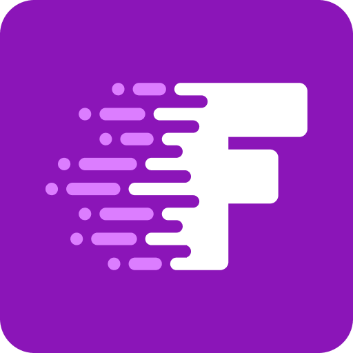

<div align="center">
  <a href="https://www/fetchforms.io">
    
  </a>

  <h3 align="center">Fetch Forms React Example</h3>

  <p align="center">
    Forms at lightning speed
    <br />
    <a href="https://www.fetchforms.io/docs/overview"><strong>Explore the docs »</strong></a>
    <br />
    <br />
</div>

### What is Fetch Forms?
Fetch Forms is a headless forms solution and form builder designed to help developers build forms and connect data.

### Prerequisites

1. [Sign up for a free account](https://www.fetchforms.io/create-account)
2. [Configure a form](https://www.fetchforms.io/docs/configuring-a-form)
3. [Create an API token](https://www.fetchforms.io/account/api-details)

### Installation
1. Clone the repo
    ```sh
    git clone https://github.com/fetchforms/react-example-app.git
    ```
2. Install NPM packages
   ```sh
   yarn
   ```
3. Add the dotenv file named `.env.local` with these params
    ```sh
    REACT_APP_FF_TOKEN=API_TOKEN
    REACT_APP_FF_FORM_ID=FORM_ID
    ```
4. Start the app
    ```sh
    yarn start
    ```

### Questions?
Fetch Form Twitter - [@fetchforms](https://twitter.com/fetchforms)<br>
Website contact form - [Contact Us](https://www.fetchforms.io/contact-us)<br>
Support Email - support@fetchforms.io

 
